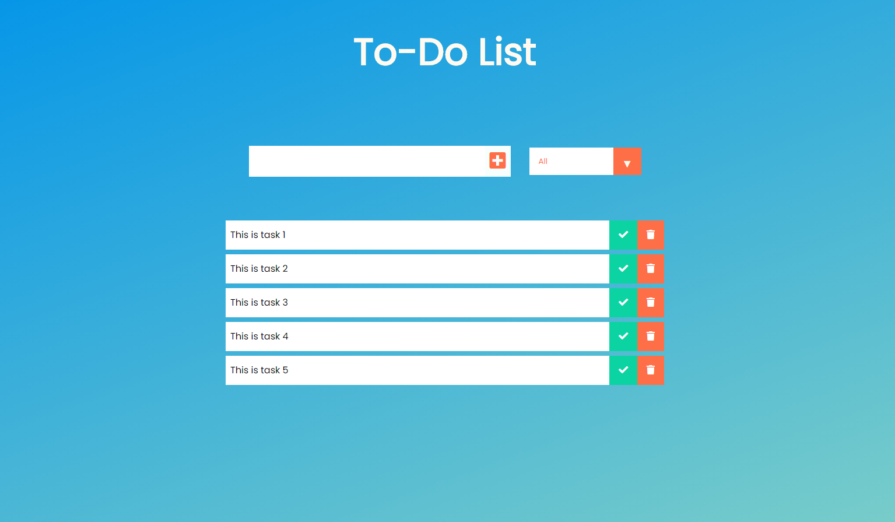

# todo-list-node.js

## Installation

You can clone this repository: git@github.com: git@github.com:git@github.com:DiegoAgui/TO-DO-LIST.git
 
## Description

This is a todo list API developed with Express.js that allows CRUD operations (Create, Read, Update, Delete) on a model. It is designed with an academic approach so that backend programming learners can use it as a starting point and begin working on it.

## Technologies Used
-Node
-Javascript
-Express
-Css
-dotenv
-mongoose
-nodemon
-react

## Accessing the Application from React

To access this todo list: in the terminal, navigate to the server folder using Git Bash and execute the command "npm start". Then, in the command prompt (cmd), navigate to the todo-list-todo-list folder and also execute the command "npm start".

You can delete, update, and add items using the "update", "delete", and "add" buttons.

You need to create an Atlas account and connect it to the app. In that case, you should change the password and username in the .env file. Delete "<#Anything that is found here>" and replace it with your password.

You can verify the updates or deletions from your Atlas account.

You can also test it using Postman.

## Contact
You can contact me via email if you have any questions or if you are interested in developing the same project at (diego.aguirre.9805@gmail.com).